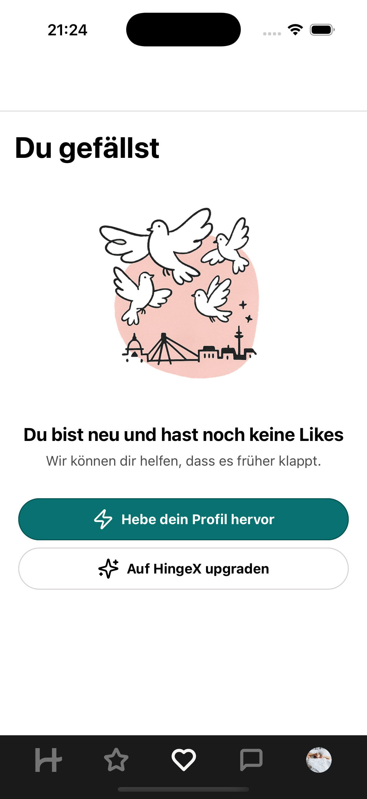
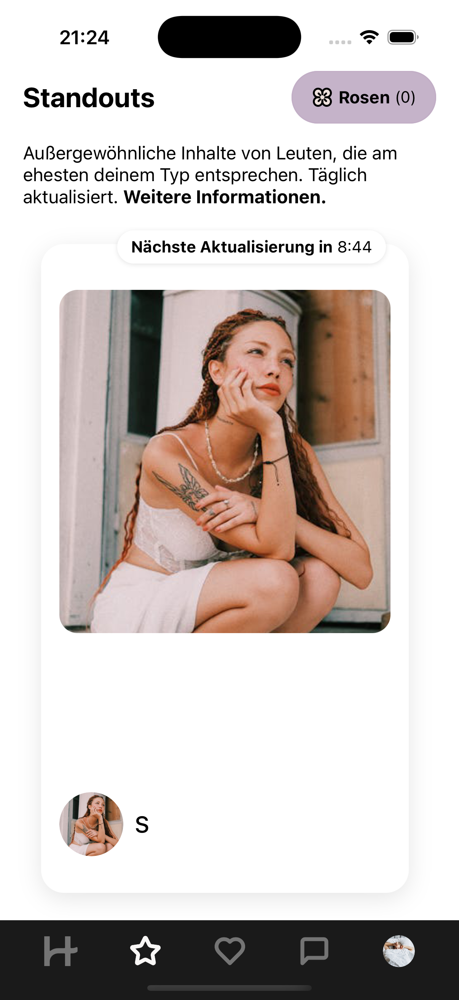

# 💘 Hinge Clone — React Native + Expo

A beautifully crafted clone of the popular dating app **Hinge**, built using **React Native** and **Expo**. This app mimics the core features of Hinge — user profiles, likes, and interactions — with a clean, mobile-first UI and smooth navigation.

---

## 🚀 Features

- 🔥 Swipeable profile cards with smooth animations  
- 💬 Like, comment, and match functionality  
- 🧑‍💼 Customizable user profiles  
- 🎨 Sleek and modern UI  
- 📱 Fully responsive on iOS and Android  

---

## 🛠 Tech Stack

- **React Native** – Cross-platform mobile development  
- **Expo** – Simplified workflow and build process  
- **React Navigation** – Seamless screen transitions  
- **Redux** – Scalable state management  
- **Firebase** – Auth and data  

---

## 📸 Screenshots

<details>
  <summary>🖼️ Empty Likes</summary>
  <br />
  
</details>

<details>
  <summary>🖼️ Empty Standouts</summary>
  <br />
  
</details>

<details>
  <summary>🖼️ Standouts View</summary>
  <br />
  
</details>

---

## 📹 Demo

> Coming soon! Screenshots and video demo in progress.

---

## 📂 Folder Structure

```
hinge-clone/ 
    ├── assets/ # Images, fonts, icons
    ├── components/ # Reusable UI components (ProfileCard, LikeButton, etc.) 
    ├── screens/ # App screens (Home, Profile, Matches, etc.)
    ├── navigation/ # Stack and tab navigation setup
    ├── context/ # Global state management (optional)
    ├── App.js # Root of the app
```
---

## 📌 Getting Started

Follow these steps to run the project locally:

1. **Clone the repository**

```bash
git clone https://github.com/your-username/hinge-clone.git
cd hinge-clone
```

2. **Install dependencies**

```bash
npm install
# or
yarn
```

3. **Start the development server**
```bash
npx expo start
```

You can then run the app on a simulator.

---

## 🤝 Contributions

Pull requests and ⭐️ stars are always welcome!
Feel free to fork this repo and create your own version of the app.

---

## 📄 License

This project is for educational/demo purposes only.
Not affiliated with or endorsed by Hinge or Match Group in any way.

---

Made with ❤️ using React Native
